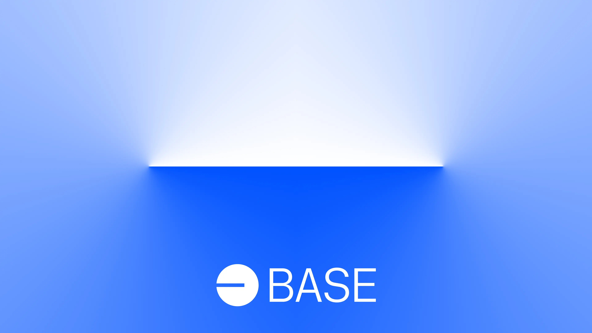

# contracts

This repo contains contracts and scripts for Base.
Note that Base primarily utilizes Optimism's bedrock contracts located in Optimism's repo [here](https://github.com/ethereum-optimism/optimism/tree/develop/packages/contracts-bedrock).
For contract deployment artifacts, see [base-org/contract-deployments](https://github.com/base-org/contract-deployments).

<!-- Badge row 1 - status -->

<!-- Badge row 2 - links and profiles -->

<!-- Badge row 3 - detailed status -->

### setup and testing

- If you don't have foundry installed, run `make install-foundry`.
- Copy `.env.example` to `.env` and fill in the variables.
- `make deps`
- Test contracts: `make test`
